# 텍스트 데이터 분석

## 01주차 텍스트 분석 개요

최 대 영 교수

고려사이버대학교
KOREA CYBER UNIVERSITY

---


## 01
주 차

# 텍스트 분석 개요

---


# 학습목차
LEARNING CONTENTS

1. 텍스트 분석과 마이닝

2. 텍스트 분석의 접근방법

---


# 학습목표
**LEARNING GOALS**

* 텍스트 분석의 목적 및 개념과 텍스트 마이닝 과정에 대해 설명할 수 있다.

* 텍스트 분석의 표현, 기법, 과업에 대해 설명할 수 있다.

---


# 01 - 텍스트 분석과 마이닝

---


# 텍스트 분석의 목적과 개념

## 텍스트 분석의 목적

텍스트 원문을 이해하는 것

흥미롭고 의미 있는 정보의 발견

> In meteorology, precipitation is any product of the condensation of atmospheric water vapor that falls under gravity. The main forms of precipitation include drizzle, rain, sleet, snow, graupel and hail... Precipitation forms as smaller droplets coalesce via collision with other rain drops or ice crystals within a cloud. Short, intense periods of rain in scattered locations are called "showers".

What causes precipitation to fall?
**gravity**

What is another main form of precipitation besides drizzle, rain, snow, sleet and hail?
**graupel**

Where do water droplets collide with ice crystals to form precipitation?
**within a cloud**

출처 | thenewstack.io/good-machine-learning-reading-understanding-documents

---


# 1 텍스트 분석의 목적과 개념

## 📄 텍스트 원문의 이해

### ○ 긴 텍스트를 이해하는 일

> **예** 글쓴이의 의도가 무엇인가? 핵심적인 메시지는 무엇인가?

**Text Summarization Process Example:**

**Input Article**
Marseille, France (CNN) The French prosecutor leading an investigation into the crash of Germanwings Flight 9525 insisted Wednesday that he was not aware of any video footage from on board the plane. Marseille prosecutor Brice Robin told CNN that " so far no videos were used in the crash investigation. " He added, " A person who has such a video needs to immediately give it to the investigators . " Robin\'s comments follow claims by two magazines, German daily Bild and French Paris Match, of a cell phone video showing the harrowing final seconds from on board Germanwings Flight 9525 as it crashed into the French Alps . All 150 on board were killed. Paris Match and Bild reported that the video was recovered from a phone at the wreckage site. ...

**Text Summarization Models:**
- Abstractive summarization
- Extractive summarization

**Generated Summary:**

**Abstractive**
Prosecutor : " So far no videos were used in the crash investigation "

**Extractive summary**
marseille prosecutor brice robin told cnn that " so far no videos were used in the crash investigation ." robin \'s comments follow claims by two magazines, german daily bild and french paris match, of a cell phone video showing the harrowing final seconds from on board germanwings flight 9525 as it crashed into the french alps . paris match and bild reported that the video was recovered from a phone at the wreckage site .

📄 출처 | techcommunity.microsoft.com


---


# 1 텍스트 분석의 목적과 개념

## 📄 텍스트 원문의 이해

### ○ 짧은 텍스트를 이해하는 일

> **예** 뉘앙스는 무엇인가? 함께 올린 사진이나 영상과는 무슨 관계인가?

<table>
<tr>
<td>
<strong>rothys</strong><br>
@rothys · Follow<br><br>
Light, flexible, machine washable - and powered by recycled water bottles.<br>
#LiveSeamlessly<br>
cards.twitter.com/cards/18ce5491...<br>
2:43 AM · Jun 17, 2017<br><br>
❤️ 246 💬 Reply 🔗 Share<br>
Read 22 replies
</td>
<td>
<strong>hint</strong><br>
@hint · Follow<br><br>
We've been telling you all along: drink water, not sugar! 🥤<br><br>
<strong>THE TRUTH ABOUT SODA</strong><br>
▶️ Watch on Twitter<br><br>
9:20 PM · Aug 28, 2017<br><br>
❤️ 1.1K 💬 Reply 🔗 Share<br>
Read 90 replies
</td>
<td>
<strong>Asana</strong> ✓<br>
@asana · Follow<br><br>
Asana is faster than ever so teams like yours can get more done—without skipping a beat. asa.na/46m<br><br>
▶️ Watch on Twitter<br>
🎬 GIF<br><br>
1:37 AM · Sep 1, 2017<br><br>
❤️ 3 💬 Reply 🔗 Share<br>
Read 1 reply
</td>
</tr>
</table>

📄 출처 | business.twitter.com/en/blog/how-to-say-more-with-short-tweets.html

---


# 1 텍스트 분석의 목적과 개념

## 텍스트 데이터의 특성

* 의미를 파악하기 쉬운 데이터
  - 텍스트 자체에 글쓴이의 의도가 담겨있음

* 부정확하거나 불확실한 데이터
  - 텍스트에서 글쓴이의 의도나 감정을 파악하기 어려움

* 구조, 형식, 내용 등이 복잡한 데이터
  - 언어가 가지는 비정형성, 함축성

---


# 1 텍스트 분석의 목적과 개념

## 📄 텍스트 데이터의 구조

* 텍스트는 기계가 만들어낸 데이터와는 달리 비정형화된 데이터 (Unstructured data)

> **예** 언어마다 문법 체계가 다르고 텍스트의 길이가 다름

* 머신러닝 등의 기법을 적용하기 위해서는 데이터의 정형화가 필요

<table>
<thead>
<tr>
<th>Unstructured Data</th>
<th>Semi-Structured Data</th>
<th>Structured Data</th>
</tr>
</thead>
<tbody>
<tr>
<td>The university has 5600 students. Shaun (ID Number: 160801), 18 years old Communication study. Linh with ID number 160802, majoring in Accounting and is 20 years old. Ahmed from Psychology study program, 19 years old, ID number 160803.</td>
<td>&lt;University&gt;<br>&lt;ID Number="160801"&gt;<br>&lt;Name="Shaun"&gt;<br>&lt;Age="18"&gt;<br>&lt;Program="Communication"&gt;<br>&lt;ID Number="160802"&gt;<br>&lt;Name="Linh"&gt;<br>&lt;Age="20"&gt;<br>&lt;Program="Accounting"&gt;<br>......... &lt;/University&gt;</td>
<td>

<table>
<thead>
<tr>
<th>ID</th>
<th>Name</th>
<th>Age</th>
<th>Program</th>
</tr>
</thead>
<tbody>
<tr>
<td>160801</td>
<td>Shaun</td>
<td>18</td>
<td>Communication</td>
</tr>
<tr>
<td>160802</td>
<td>Linh</td>
<td>20</td>
<td>Accounting</td>
</tr>
<tr>
<td>160803</td>
<td>Ahmed</td>
<td>19</td>
<td>Psychology</td>
</tr>
</tbody>
</table>

</td>
</tr>
</tbody>
</table>

📄 출처 | gleematic.com


---


# 1 텍스트 분석의 목적과 개념

## 📄 텍스트 데이터의 양

* 웹과 소셜미디어에서 생산되는 데이터가 급격히 증가
  * 소셜미디어에서 한달에 수억~수십억의 글이 생산/공유

<table>
<thead>
<tr>
<th>Year</th>
<th>Structured Data (exabytes)</th>
<th>Unstructured Data (exabytes)</th>
<th>Total (exabytes)</th>
</tr>
</thead>
<tbody>
<tr>
<td>1970</td>
<td>0</td>
<td>0</td>
<td>0</td>
</tr>
<tr>
<td>1980</td>
<td>1</td>
<td>1</td>
<td>2</td>
</tr>
<tr>
<td>1990</td>
<td>3</td>
<td>5</td>
<td>8</td>
</tr>
<tr>
<td>2000</td>
<td>8</td>
<td>15</td>
<td>23</td>
</tr>
<tr>
<td>2010</td>
<td>12</td>
<td>35</td>
<td>47</td>
</tr>
<tr>
<td>2020</td>
<td>15</td>
<td>105</td>
<td>120</td>
</tr>
</tbody>
</table>

**Legend:**
- **Unstructured**: No data model
- **Structured**: Well-defined, easily-organized database information

📄 출처 | www.komprise.com/glossary_terms/unstructured-data/

---


# 1 텍스트 분석의 목적과 개념

## 📄 데이터 마이닝(Data mining)

○ 대규모 데이터베이스에서 흥미로운 패턴을 찾는 방법론(Marti Hearst)

예| 고객이 물건을 구매하는 숨어있는 패턴을 파악하여 구매를 예측

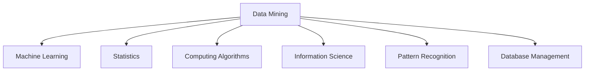

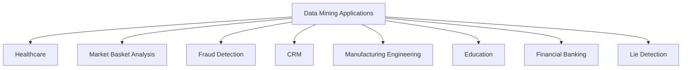

---


# 1 텍스트 분석의 목적과 개념

## 📄 텍스트 마이닝(Text mining)

* 텍스트 마이닝은 데이터 마이닝의 한 분야

* 대량의 텍스트 데이터셋에서 흥미로운 규칙들을 찾아내는 것 (Usama Fayad)

* 문자로 된 자료들로부터 자동적으로 정보를 추출하여 이전에 알려지지 않은 새로운 정보를 발견(Marti Hearst)

---


# 1 텍스트 분석의 목적과 개념

## 📊 텍스트 마이닝(Text mining)

○ 여러 학문 분야와 관련 있는 다학제(Multidisciplinary) 분야

<table>
<thead>
<tr>
<th>학문 분야</th>
<th>관련 기술/개념</th>
<th>중심 영역</th>
</tr>
</thead>
<tbody>
<tr>
<td>Data Mining</td>
<td>Document Classification, Document Clustering</td>
<td rowspan="6">Text Mining<br/>• Information Retrieval<br/>• Web Mining<br/>• Document Classification<br/>• Information Extraction<br/>• Natural Language Processing<br/>• Concept Extraction</td>
</tr>
<tr>
<td>AI and Machine Learning</td>
<td>Information Extraction, Natural Language Processing</td>
</tr>
<tr>
<td>Statistics</td>
<td>Statistical Analysis Methods</td>
</tr>
<tr>
<td>Databases</td>
<td>Information Retrieval</td>
</tr>
<tr>
<td>Library and Information Sciences</td>
<td>Information Organization and Retrieval</td>
</tr>
<tr>
<td>Computational Linguistics</td>
<td>Concept Extraction, Natural Language Processing</td>
</tr>
</tbody>
</table>

📄 출처 | https://towardsdatascience.com/a-text-analytics-primer-key-factors-in-a-text-analytics-strategy-d24dc84a5576

---


# 1 텍스트 분석의 목적과 개념

## 📄 텍스트 마이닝(Text mining)과 텍스트 분석(Text analytics)

* 텍스트 마이닝과 텍스트 분석은 거의 같은 의미로 쓰임

* 텍스트 마이닝은 '**과정**'을 더 강조

* 텍스트 분석은 '**결과**'나 '**문제의 해결**'을 더 강조

----

> 🚩 본 강의에서는 '텍스트 마이닝', '텍스트 분석', '텍스트 데이터 분석'을 구분하지 않고 사용

---


# 1 텍스트 분석의 목적과 개념

## 📄 텍스트 데이터와 비텍스트(Non-text) 데이터

○ 데이터는 실세계(Real world)에서 **센서**를 통해 수집됨

○ 텍스트 데이터 수집에서는 **인간이** **센서** 역할을 담당

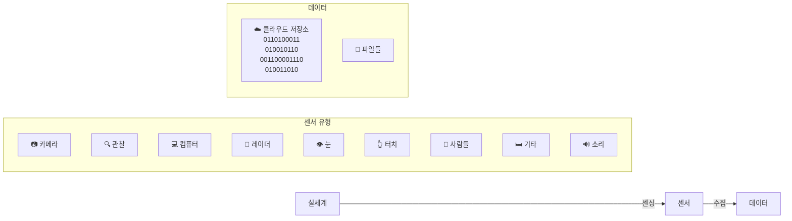

📄 출처 | ChengXiang Zhai, Text Mining and Analytics, University of Illinois at Urbana-Champaign


---


# 1 텍스트 분석의 목적과 개념

## 📄 텍스트 데이터와 비텍스트(Non-text) 데이터

* 데이터는 실세계(Real world)에서 **센서**를 통해 수집됨

* 텍스트 데이터 수집에서는 **인간이 센서 역할**을 담당

<table>
<tr>
<td>☁️<br>날씨</td>
<td>센싱<br>→</td>
<td>🌡️<br>온도계</td>
<td>수집<br>→</td>
<td>3℃<br>15℉<br>데이터</td>
</tr>
</table>

<table>
<tr>
<td>📍<br>위치</td>
<td>센싱<br>→</td>
<td>📱<br>3D-Geomag<br>위치센서</td>
<td>수집<br>→</td>
<td>북위 41도<br>데이터</td>
</tr>
</table>

📄 출처 | ChengXiang Zhai, Text Mining and Analytics, University of Illinois at Urbana-Champaign


---


# 1 텍스트 분석의 목적과 개념

## 📄 텍스트 데이터와 비텍스트(Non-text) 데이터

* 데이터는 실세계(Real world)에서 **센서**를 통해 수집됨

* 텍스트 데이터 수집에서는 **인간이 센서 역할**을 담당

<table>
<tr>
<td>실세계</td>
<td>→ 인식 →</td>
<td>사람</td>
<td>→ 표현 →</td>
<td>텍스트</td>
</tr>
</table>

📄 출처 | ChengXiang Zhai, Text Mining and Analytics, University of Illinois at Urbana-Champaign


---


# 1 텍스트 분석의 목적과 개념

## 📄 데이터 마이닝의 일반적인 문제

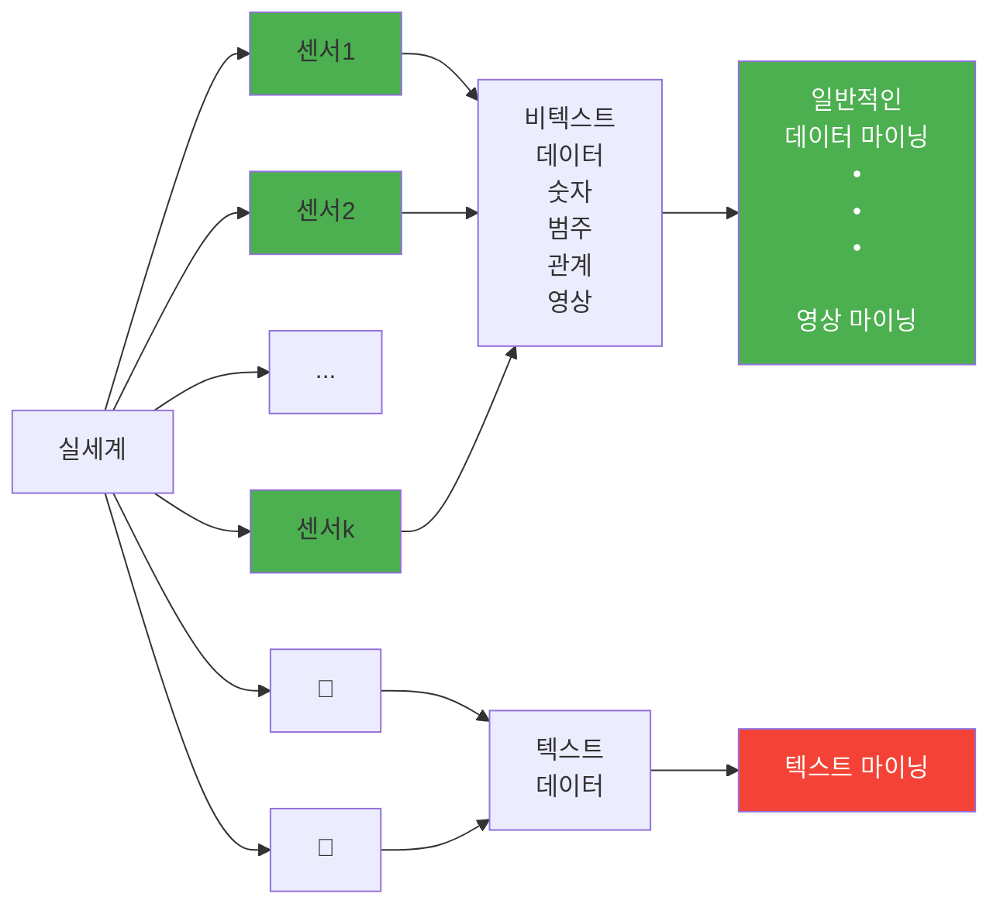

📄 출처 | ChengXiang Zhai, Text Mining and Analytics, University of Illinois at Urbana-Champaign


---


# 1 텍스트 분석의 목적과 개념

## 📄 텍스트 마이닝의 문제

```mermaid
flowchart TD
    A[실세계] --> B[👤]
    A --> C[👤]
    B --> D[비텍스트<br/>데이터]
    C --> E[텍스트<br/>데이터]
    D --> F[텍스트와<br/>비텍스트<br/>데이터를<br/>결합한<br/>데이터 마이닝]
    E --> G[텍스트 마이닝]
    F --> G
    H[실행가능한 지식<br/>(Actionable knowledge)] -.-> A
    
    style F fill:#4ade80
    style G fill:#f87171
```

출처 | ChengXiang Zhai, Text Mining and Analytics, University of Illinois at Urbana-Champaign

---


# 1 텍스트 분석의 목적과 개념

## 📋 텍스트 마이닝의 전체적인 관점

```mermaid
flowchart LR
    A[실세계] --> B[관찰된 세계]
    B --> C[텍스트]
    
    A -.-> |인식<br/>(관점)| B
    B -.-> |표현<br/>(언어)| C
    
    subgraph observed [" "]
        D["ask<br/>america<br/>congress<br/>children<br/>take<br/>help<br/>Iraq"]
    end
    
    subgraph text [" "]
        E[NEWS]
    end
    
    B --- observed
    C --- text
```

📋 출처 | ChengXiang Zhai, Text Mining and Analytics, University of Illinois at Urbana-Champaign


---


# 1 텍스트 분석의 목적과 개념

## 텍스트 마이닝의 전체적인 관점

실세계 → 인식 (관점) → 관찰된 세계 → 표현 (언어) → 텍스트

ask america congress children take help Iraq

① 언어 자체에 대한 지식 마이닝

출처 | ChengXiang Zhai, Text Mining and Analytics, University of Illinois at Urbana-Champaign

---


# 1 텍스트 분석의 목적과 개념

## 📄 텍스트 마이닝의 전체적인 관점

<table>
<tr>
<td>실세계</td>
<td>→ 인식<br/>(관점) →</td>
<td>관찰된 세계<br/><br/>ask america<br/>congress children<br/>take help iraq</td>
<td>→ 표현<br/>(언어) →</td>
<td>텍스트<br/><br/>NEWS</td>
</tr>
</table>

**② 텍스트의 내용 마이닝** ← - - - - - - - - - - → **① 언어 자체에 대한 지식 마이닝**

----

📄 출처 | ChengXiang Zhai, Text Mining and Analytics, University of Illinois at Urbana-Champaign

---


# 1 텍스트 분석의 목적과 개념

## 📋 텍스트 마이닝의 전체적인 관점

```mermaid
flowchart LR
    A[실세계] -->|인식<br/>(관점)| B[관찰된 세계]
    B -->|표현<br/>(언어)| C[텍스트]
    
    D["③ 관찰자에 대한<br/>마이닝"] -.-> B
    D -.-> C
    
    E["② 텍스트의<br/>내용 마이닝"] -.-> B
    
    F["① 언어 자체에 대한<br/>지식 마이닝"] -.-> C
    F -.-> E
```

<table>
<tr>
<td>실세계</td>
<td>→ 인식 (관점) →</td>
<td>관찰된 세계<br/>ask america<br/>congress children<br/>take help iraq</td>
<td>→ 표현 (언어) →</td>
<td>텍스트<br/>NEWS</td>
</tr>
</table>

**③ 관찰자에 대한 마이닝**

**② 텍스트의 내용 마이닝**

**① 언어 자체에 대한 지식 마이닝**

----

📋 출처 | ChengXiang Zhai, Text Mining and Analytics, University of Illinois at Urbana-Champaign

---


# 1 텍스트 분석의 목적과 개념

## 텍스트 마이닝의 전체적인 관점

```mermaid
flowchart LR
    A[실세계] -->|인식<br/>(관점)| B[관찰된 세계]
    B -->|표현<br/>(언어)| C[텍스트]
    
    D["④ 실세계에 대한 예측"] -.-> A
    E["③ 관찰자에 대한<br/>마이닝"] -.-> B
    F["② 텍스트의<br/>내용 마이닝"] -.-> B
    G["① 언어 자체에 대한<br/>지식 마이닝"] -.-> C
    
    B1[ask<br/>congress<br/>take<br/>help] -.-> B
    B2[america<br/>children<br/>Iraq] -.-> B
    
    C1[NEWS] -.-> C
```

출처 | ChengXiang Zhai, Text Mining and Analytics, University of Illinois at Urbana-Champaign


---


# 1 텍스트 분석의 목적과 개념

## 텍스트 마이닝의 전체적인 관점

```mermaid
flowchart LR
    A[실세계] -->|인식<br/>(관점)| B[관찰된 세계]
    B -->|표현<br/>(언어)| C[텍스트]
    
    D["④ 실세계에 대한 예측"] -.-> A
    E["② 텍스트의<br/>내용 마이닝"] -.-> B
    F["③ 관찰자에 대한<br/>마이닝"] -.-> B
    G["① 언어 자체에 대한<br/>지식 마이닝"] -.-> C
    
    B -.-> |ask, america<br/>congress, children<br/>take, help, Iraq| B2[관찰된 세계]
    B2 -.-> C2[NEWS<br/>텍스트]
```

<table>
<tr>
<td>실세계</td>
<td>→ 인식 (관점) →</td>
<td>관찰된 세계</td>
<td>→ 표현 (언어) →</td>
<td>텍스트</td>
</tr>
<tr>
<td colspan="5">
관찰된 세계의 예시 단어들: ask, america, congress, children, take, help, Iraq
</td>
</tr>
</table>

**텍스트 마이닝의 네 가지 관점:**

① 언어 자체에 대한 지식 마이닝

② 텍스트의 내용 마이닝

③ 관찰자에 대한 마이닝

④ 실세계에 대한 예측

출처 | ChengXiang Zhai, Text Mining and Analytics, University of Illinois at Urbana-Champaign


---


# 1 텍스트 분석의 목적과 개념

## 📋 텍스트 마이닝의 전체적인 관점

```mermaid
flowchart LR
    A[실세계] -->|인식<br/>(관점)| B[관찰된 세계]
    B -->|표현<br/>(언어)| C[텍스트]
    
    D["④ 실세계에 대한 예측"] -.-> A
    E["② 텍스트의<br/>내용 마이닝"] -.-> B
    F["③ 관찰자에 대한<br/>마이닝"] -.-> B
    G["① 언어 자체에 대한<br/>지식 마이닝"] -.-> C
    
    H["+ 비텍스트 데이터"] -.-> D
    
    subgraph observed ["관찰된 세계 내용"]
        I["ask america<br/>congress children<br/>take help Iraq"]
    end
    
    B -.-> observed
    
    subgraph news ["텍스트 예시"]
        J[NEWS<br/>신문 이미지]
    end
    
    C -.-> news
```

📄 출처 | ChengXiang Zhai, Text Mining and Analytics, University of Illinois at Urbana-Champaign

---


# 1 텍스트 분석의 목적과 개념

## 텍스트 마이닝의 전체적인 관점

```mermaid
flowchart LR
    A[실세계] -->|인식<br/>(관점)| B[관찰된 세계]
    B -->|표현<br/>(언어)| C[텍스트 + 맥락]
    
    D["④ 실세계에 대한 예측"] -.-> A
    E["② 텍스트의<br/>내용 마이닝"] -.-> B
    F["③ 관찰자에 대한<br/>마이닝"] -.-> B
    G["① 언어 자체에 대한<br/>지식 마이닝"] -.-> C
    
    H["+ 비텍스트 데이터"] -.-> C
    
    B1["ask<br/>congress<br/>take<br/>help"] --> B
    B2["america<br/>children<br/>Iraq"] --> B
    
    C --> I[NEWS]
```

<table>
<tr>
<td>실세계</td>
<td>→ 인식 (관점) →</td>
<td>관찰된 세계</td>
<td>→ 표현 (언어) →</td>
<td>텍스트 + 맥락</td>
</tr>
<tr>
<td colspan="5">
관련 마이닝 접근법:<br/>
① 언어 자체에 대한 지식 마이닝<br/>
② 텍스트의 내용 마이닝<br/>
③ 관찰자에 대한 마이닝<br/>
④ 실세계에 대한 예측<br/>
+ 비텍스트 데이터
</td>
</tr>
<tr>
<td colspan="5">
관찰된 데이터 예시: ask, america, congress, children, take, help, Iraq
</td>
</tr>
</table>

출처 | ChengXiang Zhai, Text Mining and Analytics, University of Illinois at Urbana-Champaign

---


# 1 텍스트 분석의 목적과 개념

## 텍스트 마이닝의 전체적인 관점

```mermaid
flowchart TD
    A[실세계] -->|인식<br/>(관점)| B[관찰된 세계]
    B -->|표현<br/>(언어)| C[텍스트 + 맥락]
    
    D["④ 실세계에 대한 예측"]
    E["③ 관찰자에 대한<br/>마이닝"]
    F["② 텍스트의<br/>내용 마이닝"]
    G["① 언어 자체에 대한<br/>지식 마이닝"]
    
    H["+ 비텍스트 데이터"]
    
    A -.-> D
    D -.-> E
    E -.-> B
    B -.-> F
    F -.-> G
    G -.-> C
    C --> H
    H --> E
    
    subgraph observed ["관찰된 세계 내용"]
        I["ask america<br/>congress children<br/>take help Iraq"]
    end
    
    subgraph news ["뉴스"]
        J[NEWS]
    end
    
    B --- observed
    observed --- news
```

출처 | ChengXiang Zhai, Text Mining and Analytics, University of Illinois at Urbana-Champaign

---


# 2 텍스트 마이닝 과정

## 텍스트 마이닝 과정

<table>
<thead>
<tr>
<th>텍스트 수집</th>
<th>텍스트 전처리</th>
<th>텍스트 분석</th>
<th>텍스트 시각화</th>
</tr>
</thead>
<tbody>
<tr>
<td>API 활용 수집</td>
<td>형태소 분석</td>
<td>문서 분류/<br>생성/요약</td>
<td>워드 클라우드</td>
</tr>
<tr>
<td>웹 스크래핑</td>
<td>워드 임베딩</td>
<td>감성 분석</td>
<td>트리맵</td>
</tr>
<tr>
<td></td>
<td></td>
<td>토픽 모델링</td>
<td>연관어 분석</td>
</tr>
<tr>
<td></td>
<td></td>
<td>기계번역</td>
<td></td>
</tr>
<tr>
<td></td>
<td></td>
<td>네트워크 분석</td>
<td></td>
</tr>
</tbody>
</table>


---


# 2 텍스트 마이닝 과정

## 📄 텍스트 수집

* API(Application Programming Interface) 활용 수집
  - API를 이용한 프로그래밍을 통해 데이터를 추출하는 방법

> **API**
> 
> 둘 이상의 컴퓨터 프로그램이 통신하기 위한 방법

---


# 2 텍스트 마이닝 과정

## 📄 텍스트 수집

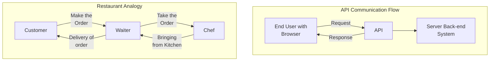

📄 출처 | https://www.geeksforgeeks.org/what-is-an-api/

---


# 2 텍스트 마이닝 과정

## 텍스트 수집

* 웹 스크래핑(Scraping)
  - 웹페이지에서 규칙을 찾아 원하는 정보를 추출하는 방법

* 웹 스크래핑 절차
  1. 웹 스크래핑 프로그램을 통해 웹페이지에 데이터를 요청
  2. 웹페이지의 HTML 코드에서 정해진 규칙에 맞게 데이터를 추출
  3. 추출한 데이터를 전송 받아 원하는 형식으로 저장

---


# 2 텍스트 마이닝 과정

## 📄 텍스트 수집

### How does Web Scraping Work?

<table>
<tr>
<td>1</td>
<td>2</td>
<td>3</td>
</tr>
<tr>
<td>Request<br>Response</td>
<td>Parse and<br>Extract</td>
<td>Download<br>Data</td>
</tr>
</table>

📄 출처 | https://prowebscraper.com/blog/what-is-web-scraping/

---


# 2 텍스트 마이닝 과정

## 형태소 분석

Tech companies including Google, Facebook, Uber to lobby for 'Dreamers' to remain in US @sal19 @JLDastin report: http://reut.rs/2zooGrV

**토큰화(Tokenization) 및 불필요 단어 제거**

'tech', 'companies', 'including', 'google', 'facebook', 'uber', 'to', 'lobby', 'for', 'dreamers', 'to', 'remain', 'in', 'us', ~~@sal19 @JLDastin~~, 'report', ~~http://reut.rs/...~~

**불용어(Stopword) 제거**

'tech', 'companies', 'including', 'google', 'facebook', 'uber', ~~'to'~~, 'lobby', ~~'for'~~, 'dreamers', ~~'to'~~, 'remain', ~~'in'~~, 'us', ~~'report'~~

**저빈도 단어 제거**

'tech', 'companies', 'including', 'google', 'facebook', 'uber', 'lobby', ~~'dreamers'~~, 'remain', 'us'

**어간추출(Stemming)**

'tech', 'companies', 'including', 'google', 'facebook', 'uber', 'lobby', 'remain', 'us'

**품사 태깅**

[('tech', 'NN'), ('compani', 'NN'), ('includ', 'NN'), ('googl', 'NN'), ('facebook', 'NN'), ('uber', 'NNP'), ('lobbi', 'NN'), ('remain', 'VBP'), ('us', 'NNP')]

---


# 2 텍스트 마이닝 과정

## 📄 One-hot encoding과 워드 임베딩(Word embedding)

* 워드 임베딩: 단어를 다차원의 추상적인 공간에 표현한 벡터
* 만약 데이터에 오직 16개의 단어만 존재한다면  
  Element가 16개인 One-hot-encoded vector로 표현 가능

<table>
<thead>
<tr>
<th>One-hot</th>
<th>this</th>
<th>is</th>
<th>one</th>
<th>of</th>
<th>the</th>
<th>best</th>
<th>films</th>
<th>actually</th>
<th>the</th>
<th>best</th>
<th>i</th>
<th>have</th>
<th>ever</th>
<th>seen</th>
<th>the</th>
<th>film</th>
<th>starts</th>
<th>one</th>
<th>fall</th>
<th>day</th>
</tr>
</thead>
<tbody>
<tr>
<td></td>
<td>■</td>
<td></td>
<td></td>
<td></td>
<td></td>
<td></td>
<td></td>
<td></td>
<td></td>
<td></td>
<td></td>
<td></td>
<td></td>
<td></td>
<td></td>
<td>■</td>
<td>■</td>
<td></td>
<td></td>
</tr>
<tr>
<td></td>
<td></td>
<td>■</td>
<td></td>
<td></td>
<td></td>
<td></td>
<td></td>
<td></td>
<td></td>
<td></td>
<td></td>
<td></td>
<td></td>
<td></td>
<td></td>
<td></td>
<td></td>
<td></td>
<td></td>
</tr>
<tr>
<td></td>
<td></td>
<td></td>
<td>■</td>
<td></td>
<td></td>
<td></td>
<td></td>
<td></td>
<td></td>
<td></td>
<td></td>
<td></td>
<td></td>
<td></td>
<td></td>
<td></td>
<td></td>
<td>■</td>
<td></td>
</tr>
<tr>
<td></td>
<td></td>
<td></td>
<td></td>
<td>■</td>
<td></td>
<td></td>
<td></td>
<td></td>
<td></td>
<td></td>
<td></td>
<td></td>
<td></td>
<td></td>
<td></td>
<td></td>
<td></td>
<td></td>
<td></td>
</tr>
<tr>
<td></td>
<td></td>
<td></td>
<td></td>
<td></td>
<td>■</td>
<td></td>
<td></td>
<td></td>
<td></td>
<td></td>
<td></td>
<td></td>
<td></td>
<td></td>
<td>■</td>
<td></td>
<td></td>
<td></td>
<td></td>
</tr>
<tr>
<td></td>
<td></td>
<td></td>
<td></td>
<td></td>
<td></td>
<td>■</td>
<td></td>
<td></td>
<td>■</td>
<td>■</td>
<td></td>
<td></td>
<td></td>
<td></td>
<td></td>
<td></td>
<td></td>
<td></td>
<td></td>
</tr>
<tr>
<td></td>
<td></td>
<td></td>
<td></td>
<td></td>
<td></td>
<td></td>
<td>■</td>
<td></td>
<td></td>
<td></td>
<td></td>
<td></td>
<td></td>
<td></td>
<td></td>
<td>■</td>
<td></td>
<td></td>
<td></td>
</tr>
<tr>
<td></td>
<td></td>
<td></td>
<td></td>
<td></td>
<td></td>
<td></td>
<td></td>
<td>■</td>
<td></td>
<td></td>
<td></td>
<td></td>
<td></td>
<td></td>
<td></td>
<td></td>
<td></td>
<td></td>
<td></td>
</tr>
<tr>
<td></td>
<td></td>
<td></td>
<td></td>
<td></td>
<td></td>
<td></td>
<td></td>
<td></td>
<td></td>
<td></td>
<td>■</td>
<td></td>
<td></td>
<td></td>
<td></td>
<td></td>
<td></td>
<td></td>
<td></td>
</tr>
<tr>
<td></td>
<td></td>
<td></td>
<td></td>
<td></td>
<td></td>
<td></td>
<td></td>
<td></td>
<td></td>
<td></td>
<td></td>
<td>■</td>
<td></td>
<td></td>
<td></td>
<td></td>
<td></td>
<td></td>
<td></td>
</tr>
<tr>
<td></td>
<td></td>
<td></td>
<td></td>
<td></td>
<td></td>
<td></td>
<td></td>
<td></td>
<td></td>
<td></td>
<td></td>
<td></td>
<td>■</td>
<td></td>
<td></td>
<td></td>
<td></td>
<td></td>
<td></td>
</tr>
<tr>
<td></td>
<td></td>
<td></td>
<td></td>
<td></td>
<td></td>
<td></td>
<td></td>
<td></td>
<td></td>
<td></td>
<td></td>
<td></td>
<td></td>
<td>■</td>
<td></td>
<td></td>
<td></td>
<td></td>
<td></td>
</tr>
<tr>
<td></td>
<td></td>
<td></td>
<td></td>
<td></td>
<td></td>
<td></td>
<td></td>
<td></td>
<td></td>
<td></td>
<td></td>
<td></td>
<td></td>
<td></td>
<td></td>
<td></td>
<td>■</td>
<td></td>
<td></td>
</tr>
<tr>
<td></td>
<td></td>
<td></td>
<td></td>
<td></td>
<td></td>
<td></td>
<td></td>
<td></td>
<td></td>
<td></td>
<td></td>
<td></td>
<td></td>
<td></td>
<td></td>
<td></td>
<td></td>
<td></td>
<td>■</td>
</tr>
<tr>
<td></td>
<td></td>
<td></td>
<td></td>
<td></td>
<td></td>
<td></td>
<td></td>
<td></td>
<td></td>
<td></td>
<td></td>
<td></td>
<td></td>
<td></td>
<td></td>
<td></td>
<td></td>
<td></td>
<td></td></tr>
<tr>
<td></td>
<td></td>
<td></td>
<td></td>
<td></td>
<td></td>
<td></td>
<td></td>
<td></td>
<td></td>
<td></td>
<td></td>
<td></td>
<td></td>
<td></td>
<td></td>
<td></td>
<td></td>
<td></td>
<td></td>
<t

# 2 텍스트 마이닝 과정

## 📄 One-hot encoding과 워드 임베딩(Word embedding)

* 워드 임베딩: 단어를 다차원의 추상적인 공간에 표현한 벡터
* 만약 데이터에 오직 16개의 단어만 존재한다면  
  Element가 16개인 One-hot-encoded vector로 표현 가능

<table>
<thead>
<tr>
<th></th>
<th>this</th>
<th>is</th>
<th>one</th>
<th>of</th>
<th>the</th>
<th>best</th>
<th>films</th>
<th>actually</th>
<th>the</th>
<th>best</th>
<th>i</th>
<th>have</th>
<th>ever</th>
<th>seen</th>
<th>the</th>
<th>film</th>
<th>starts</th>
<th>one</th>
<th>fall</th>
<th>day</th>
</tr>
</thead>
<tbody>
<tr>
<td rowspan="16">One-hot</td>
<td>■</td>
<td></td>
<td></td>
<td></td>
<td></td>
<td></td>
<td></td>
<td></td>
<td></td>
<td></td>
<td></td>
<td></td>
<td></td>
<td></td>
<td></td>
<td></td>
<td></td>
<td></td>
<td></td>
<td></td>
</tr>
<tr>
<td></td>
<td>■</td>
<td></td>
<td></td>
<td></td>
<td></td>
<td></td>
<td></td>
<td></td>
<td></td>
<td></td>
<td></td>
<td></td>
<td></td>
<td></td>
<td></td>
<td></td>
<td></td>
<td></td>
<td></td>
</tr>
<tr>
<td></td>
<td></td>
<td>■</td>
<td></td>
<td></td>
<td></td>
<td></td>
<td></td>
<td></td>
<td></td>
<td></td>
<td></td>
<td></td>
<td></td>
<td></td>
<td></td>
<td></td>
<td>■</td>
<td></td>
<td></td>
</tr>
<tr>
<td></td>
<td></td>
<td></td>
<td>■</td>
<td></td>
<td></td>
<td></td>
<td></td>
<td></td>
<td></td>
<td></td>
<td></td>
<td></td>
<td></td>
<td></td>
<td></td>
<td></td>
<td></td>
<td></td>
<td></td>
</tr>
<tr>
<td></td>
<td></td>
<td></td>
<td></td>
<td>■</td>
<td></td>
<td></td>
<td></td>
<td>■</td>
<td></td>
<td></td>
<td></td>
<td></td>
<td></td>
<td>■</td>
<td></td>
<td></td>
<td></td>
<td></td>
<td></td>
</tr>
<tr>
<td></td>
<td></td>
<td></td>
<td></td>
<td></td>
<td>■</td>
<td></td>
<td></td>
<td></td>
<td>■</td>
<td></td>
<td></td>
<td></td>
<td></td>
<td></td>
<td></td>
<td></td>
<td></td>
<td></td>
<td></td>
</tr>
<tr>
<td></td>
<td></td>
<td></td>
<td></td>
<td></td>
<td></td>
<td>■</td>
<td></td>
<td></td>
<td></td>
<td></td>
<td></td>
<td></td>
<td></td>
<td></td>
<td></td>
<td></td>
<td></td>
<td></td>
<td></td>
</tr>
<tr>
<td></td>
<td></td>
<td></td>
<td></td>
<td></td>
<td></td>
<td></td>
<td>■</td>
<td></td>
<td></td>
<td></td>
<td></td>
<td></td>
<td></td>
<td></td>
<td>■</td>
<td></td>
<td></td>
<td></td>
<td></td>
</tr>
<tr>
<td></td>
<td></td>
<td></td>
<td></td>
<td></td>
<td></td>
<td></td>
<td></td>
<td></td>
<td></td>
<td></td>
<td></td>
<td></td>
<td></td>
<td></td>
<td></td>
<td></td>
<td></td>
<td></td>
<td></td>
</tr>
<tr>
<td></td>
<td></td>
<td></td>
<td></td>
<td></td>
<td></td>
<td></td>
<td></td>
<td></td>
<td></td>
<td></td>
<td>■</td>
<td></td>
<td></td>
<td></td>
<td></td>
<td></td>
<td></td>
<td></td>
<td></td>
</tr>
<tr>
<td></td>
<td></td>
<td></td>
<td></td>
<td></td>
<td></td>
<td></td>
<td></td>
<td></td>
<td></td>
<td></td>
<td></td>
<td>■</td>
<td></td>
<td></td>
<td></td>
<td></td>
<td></td>
<td></td>
<td></td>
</tr>
<tr>
<td></td>
<td></td>
<td></td>
<td></td>
<td></td>
<td></td>
<td></td>
<td></td>
<td></td>
<td></td>
<td></td>
<td></td>
<td></td>
<td>■</td>
<td></td>
<td></td>
<td></td>
<td></td>
<td></td>
<td></td>
</tr>
<tr>
<td></td>
<td></td>
<td></td>
<td></td>
<td></td>
<td></td>
<td></td>
<td></td>
<td></td>
<td></td>
<td></td>
<td></td>
<td></td>
<td></td>
<td>■</td>
<td></td>
<td></td>
<td></td>
<td></td>
<td></td>
</tr>
<tr>
<td></td>
<td></td>
<td></td>
<td></td>
<td></td>
<td></td>
<td></td>
<td></td>
<td></td>
<td></td>
<td></td>
<td></td>
<td></td>
<td></td>
<td></td>
<td></td>
<td>■</td>
<td></td>
<td></td>
<td></td>
</tr>
<tr>
<td></td>
<td></td>
<td></td>
<td></td>
<td></td>
<td></td>
<td></td>
<td></td>
<td></td>
<td></td>
<td></td>
<td></td>
<td></td>
<td></td>
<td></td>
<td></td>
<td></td>
<td>■</td>
<td></td>
<td></td>
</tr>
<tr>
<td></td>
<td></td>
<td></td>
<td></td>
<td></td>
<td></td>
<td></td>
<td></td>
<td></td>
<td></td>
<td></td>
<td></td>
<td></td>
<td></td>
<td></td>
<td></td>
<td></td>
<td></td>
<td>■</td>
<td></td>
</tr>
</tbody>
</table>

📄 출처 | James et al., An Introduction to Statistical Learning, 2021

---


# 2 텍스트 마이닝 과정

## 📄 One-hot encoding과 워드 임베딩(Word embedding)

<table>
<thead>
<tr>
<th>One-Hot</th>
<th>this</th>
<th>is</th>
<th>one</th>
<th>of</th>
<th>the</th>
<th>best</th>
<th>films</th>
<th>actually</th>
<th>the</th>
<th>best</th>
<th>i</th>
<th>have</th>
<th>ever</th>
<th>seen</th>
<th>the</th>
<th>film</th>
<th>starts</th>
<th>one</th>
<th>fall</th>
<th>day</th>
<th>→</th>
<th>this</th>
<th>is</th>
<th>...</th>
<th>day</th>
</tr>
</thead>
<tbody>
<tr>
<td></td>
<td>■</td>
<td></td>
<td></td>
<td></td>
<td></td>
<td></td>
<td></td>
<td></td>
<td></td>
<td></td>
<td></td>
<td></td>
<td></td>
<td></td>
<td></td>
<td></td>
<td></td>
<td></td>
<td></td>
<td></td>
<td>0</td>
<td>0</td>
<td></td>
<td>0</td>
</tr>
<tr>
<td></td>
<td></td>
<td>■</td>
<td></td>
<td></td>
<td></td>
<td></td>
<td></td>
<td></td>
<td></td>
<td></td>
<td></td>
<td></td>
<td></td>
<td></td>
<td></td>
<td></td>
<td></td>
<td></td>
<td></td>
<td></td>
<td>0</td>
<td>0</td>
<td></td>
<td>0</td>
</tr>
<tr>
<td></td>
<td></td>
<td></td>
<td>■</td>
<td></td>
<td></td>
<td></td>
<td></td>
<td></td>
<td></td>
<td></td>
<td></td>
<td></td>
<td></td>
<td></td>
<td></td>
<td></td>
<td></td>
<td></td>
<td></td>
<td></td>
<td>0</td>
<td>0</td>
<td></td>
<td>0</td>
</tr>
<tr>
<td></td>
<td></td>
<td></td>
<td></td>
<td>■</td>
<td></td>
<td></td>
<td></td>
<td></td>
<td></td>
<td></td>
<td></td>
<td></td>
<td></td>
<td></td>
<td></td>
<td></td>
<td></td>
<td></td>
<td></td>
<td></td>
<td>0</td>
<td>0</td>
<td></td>
<td>0</td>
</tr>
<tr>
<td></td>
<td></td>
<td></td>
<td></td>
<td></td>
<td>■</td>
<td></td>
<td></td>
<td></td>
<td></td>
<td></td>
<td></td>
<td></td>
<td></td>
<td></td>
<td></td>
<td></td>
<td></td>
<td></td>
<td></td>
<td></td>
<td>0</td>
<td>0</td>
<td></td>
<td>0</td>
</tr>
<tr>
<td></td>
<td></td>
<td></td>
<td></td>
<td></td>
<td></td>
<td>■</td>
<td></td>
<td></td>
<td></td>
<td></td>
<td></td>
<td></td>
<td></td>
<td></td>
<td></td>
<td></td>
<td></td>
<td></td>
<td></td>
<td></td>
<td>0</td>
<td>0</td>
<td></td>
<td>0</td>
</tr>
<tr>
<td></td>
<td></td>
<td></td>
<td></td>
<td></td>
<td></td>
<td></td>
<td>■</td>
<td></td>
<td></td>
<td></td>
<td></td>
<td></td>
<td></td>
<td></td>
<td></td>
<td></td>
<td></td>
<td></td>
<td></td>
<td></td>
<td>0</td>
<td>0</td>
<td></td>
<td>0</td>
</tr>
<tr>
<td></td>
<td></td>
<td></td>
<td></td>
<td></td>
<td></td>
<td></td>
<td></td>
<td>■</td>
<td></td>
<td></td>
<td></td>
<td></td>
<td></td>
<td></td>
<td></td>
<td></td>
<td></td>
<td></td>
<td></td>
<td></td>
<td>0</td>
<td>0</td>
<td></td>
<td>0</td>
</tr>
<tr>
<td></td>
<td></td>
<td></td>
<td></td>
<td></td>
<td></td>
<td></td>
<td></td>
<td></td>
<td>■</td>
<td></td>
<td></td>
<td></td>
<td></td>
<td></td>
<td></td>
<td></td>
<td></td>
<td></td>
<td></td>
<td></td>
<td>0</td>
<td>0</td>
<td></td>
<td>0</td>
</tr>
<tr>
<td></td>
<td></td>
<td></td>
<td></td>
<td></td>
<td></td>
<td></td>
<td></td>
<td></td>
<td></td>
<td>■</td>
<td></td>
<td></td>
<td></td>
<td></td>
<td></td>
<td></td>
<td></td>
<td></td>
<td></td>
<td></td>
<td>0</td>
<td>0</td>
<td></td>
<td>0</td>
</tr>
<tr>
<td></td>
<td></td>
<td></td>
<td></td>
<td></td>
<td></td>
<td></td>
<td></td>
<td></td>
<td></td>
<td></td>
<td>■</td>
<td></td>
<td></td>
<td></td>
<td></td>
<td></td>
<td></td>
<td></td>
<td></td>
<td></td>
<td>0</td>
<td>0</td>
<td></td>
<td>0</td>
</tr>
<tr>
<td></td>
<td></td>
<td></td>
<td></td>
<td></td>
<td></td>
<td></td>
<td></td>
<td></td>
<td></td>
<td></td>
<td></td>
<td>■</td>
<td></td>
<td></td>
<td></td>
<td></td>
<td></td>
<td></td>
<td></td>
<td></td>
<td>0</td>
<td>0</td>
<td></td>
<td>0</td>
</tr>
<tr>
<td></td>
<td></td>
<td></td>
<td></td>
<td></td>
<td></td>
<td></td>
<td></td>
<td></td>
<td></td>
<td></td>
<td></td>
<td></td>
<td>■</td>
<td></td>
<td></td>
<td></td>
<td></td>
<td></td>
<td></td>
<td></td>
<td>1</td>
<td>0</td>
<td></td>
<td>0</td>
</tr>
<tr>
<td></td>
<td></td>
<td></td>
<td></td>
<td></td>
<td></td>
<td></td>
<td></td>
<td></td>
<td></td>
<td></td>
<td></td>
<td></td>
<td></td>
<td>■</td>
<td></td>
<td></td>
<td></td>
<td></td>
<td></td>
<td></td>
<td>0</td>
<td>1</td>
<td></td>
<td>0</td>
</tr>
<tr>
<td></td>
<td></td>
<td></td>
<td></td>
<td></td>
<td></td>
<td></td>
<td></td>
<td></td>
<td></td>
<td></td>
<td></td>
<td></td>
<td></td>
<td></td>
<td>■</td>
<td></td>
<td></td>
<td></td>
<td></td>
<td></td>
<td>0</td>
<td>0</td>
<td></td>
<td>1</td>
</tr>
<tr>
<td></td>
<td></td>
<td></td>
<td></td>
<td></td>
<td></td>
<td></td>
<td></td>
<td></td>
<td></td>
<td></td>
<td></td>
<td></td>
<td></td>
<td></td>
<td></td>
<td>■</td>
<td></td>
<td></td>
<td></td>
<td></td>
<td>0</td>
<td>0</td>
<td></td>
<td>0</td>
</tr>
<tr>
<td></td>
<td></td>
<td></td>
<td></td>
<td></td>
<td></td>
<td></td>
<td></td>
<td></td>
<td></td>
<td></td>
<td></td>
<td></td>
<td></td>
<td></td>
<td></td>
<td></td>
<td>■</td>
<td></td>
<td></td>
<td></td>
<td>0</td>
<td>0</td>
<td></td>
<td>0</td>
</tr>
<tr>
<td></td>
<td></td>
<td></td>
<td></td>
<td></td>
<td></td>
<td></td>
<td></td>
<td></td>
<td></td>
<td></td>
<td></td>
<td></td>
<td></td>
<td></td>
<td></td>
<td></td>
<td></td>
<td>■</td>
<td></td>
<td></td>
<td>0</td>
<td>0</td>
<td></td>
<td>0</td>
</tr>
<tr>
<td></td>
<td></td>
<td></td>
<td></td>
<td></td>
<td></td>
<td></td>
<td></td>
<td></td>
<td></td>
<td></td>
<td></td>
<td></td>
<td></td>
<td></td>
<td></td>
<td></td>
<td></td>
<td></td>
<td>■</td>
<td></td>
<td>0</td>
<td>0</td>
<td></td>
<td>0</td>
</tr>
</tbody>
</table>

📄 출처 | James et al., An Introduction to Statistical Learning, 2021

---


# 2 텍스트 마이닝 과정

## 📄 고차원 워드 임베딩

<table>
<thead>
<tr>
<th>Word Categories</th>
<th>queen</th>
<th>woman</th>
<th>girl</th>
<th>boy</th>
<th>man</th>
<th>king</th>
<th>queen</th>
<th>water</th>
</tr>
</thead>
<tbody>
<tr>
<td>non-royal?</td>
<td style="background-color: lightblue;">-</td>
<td style="background-color: lightcoral;">+</td>
<td style="background-color: lightcoral;">+</td>
<td style="background-color: lightcoral;">+</td>
<td style="background-color: lightcoral;">+</td>
<td style="background-color: lightblue;">-</td>
<td style="background-color: lightblue;">-</td>
<td style="background-color: lightcoral;">+</td>
</tr>
<tr>
<td>human?</td>
<td style="background-color: lightcoral;">+</td>
<td style="background-color: lightcoral;">+</td>
<td style="background-color: lightcoral;">+</td>
<td style="background-color: lightcoral;">+</td>
<td style="background-color: lightcoral;">+</td>
<td style="background-color: lightcoral;">+</td>
<td style="background-color: lightcoral;">+</td>
<td style="background-color: darkred;">-</td>
</tr>
<tr>
<td>child?</td>
<td style="background-color: lightblue;">-</td>
<td style="background-color: lightblue;">-</td>
<td style="background-color: lightcoral;">+</td>
<td style="background-color: lightcoral;">+</td>
<td style="background-color: lightblue;">-</td>
<td style="background-color: lightblue;">-</td>
<td style="background-color: lightblue;">-</td>
<td style="background-color: lightblue;">-</td>
</tr>
</tbody>
</table>

**Color Scale:** -1.6 (dark red) to 1.6 (dark blue)

⬇️ **Transformation to numerical representation:**

<table>
<thead>
<tr>
<th>Word</th>
<th>Dimension 1</th>
<th>Dimension 2</th>
<th>Dimension 3</th>
</tr>
</thead>
<tbody>
<tr>
<td>queen</td>
<td>-0.71</td>
<td>0.04</td>
<td>-0.77</td>
</tr>
<tr>
<td></td>
<td>0.05</td>
<td>0.71</td>
<td>0.73</td>
</tr>
<tr>
<td></td>
<td>-1.51</td>
<td>-0.89</td>
<td>-0.68</td>
</tr>
<tr>
<td></td>
<td>⋮</td>
<td>⋮</td>
<td>⋮</td>
</tr>
<tr>
<td></td>
<td>...</td>
<td>...</td>
<td>...</td>
</tr>
<tr>
<td></td>
<td>⋮</td>
<td>⋮</td>
<td>⋮</td>
</tr>
<tr>
<td>woman</td>
<td>-0.9</td>
<td>-0.69</td>
<td>0.05</td>
</tr>
<tr>
<td></td>
<td>1.89</td>
<td>0.78</td>
<td>0.78</td>
</tr>
<tr>
<td></td>
<td>0.79</td>
<td>0.03</td>
<td>0.76</td>
</tr>
<tr>
<td>water</td>
<td colspan="3">water</td>
</tr>
</tbody>
</table>

📄 출처 | jalammar.github.io/illustrated-word2vec


---


# 2 텍스트 마이닝 과정

## 📄 텍스트 분석(협의의 텍스트 분석)

* 문서 분류/생성/요약, 감성 분석, 토픽 모델링, 기계번역, 네트워크 분석, 개체명 인식 등

**Natural Language Processing** applications include:

- **Document Classification** (파란색 박스)
- **Dialog Systems** (노란색 박스)  
- **Word Sense Disambiguation** (초록색 박스)
- **Machine Translation** (주황색 박스)
- **Summarization and Generation** (회색 박스)
- **Question and Answer** (하늘색 박스)
- **Sentiment Analysis** (빨간색 박스)
- **CoReference Resolution** (보라색 박스)

📄 출처 | gipplab.org/deep-learning-for-natural-language-processing


---


# 2 텍스트 마이닝 과정

## 📄 텍스트 시각화

### ➡️ 워드 클라우드

단어 빈도에 따라 글자의 크기와 색상을 다르게 표현

<table>
<tr>
<td colspan="6">Word Cloud Visualization</td>
</tr>
<tr>
<td>fun</td>
<td>easy</td>
<td>inclusive</td>
<td>share</td>
<td>software</td>
<td>cool</td>
</tr>
<tr>
<td>presentations</td>
<td>live</td>
<td>beautiful</td>
<td>reflection</td>
<td>exciting</td>
<td>anonymous</td>
</tr>
<tr>
<td>thoughts</td>
<td>interactive</td>
<td>brainstorm</td>
<td>knowledge</td>
<td>ideas</td>
<td>ice breaker</td>
</tr>
</table>

출처 | www.mentimeter.com/blog/audience-energizers/live-audience-word-clouds

---


# 2 텍스트 마이닝 과정

## 📄 텍스트 시각화

### ➡️ 트리맵

텍스트에 범주와 계층 정보를 함께 표현

<table>
<thead>
<tr>
<th>상품</th>
<th>비율</th>
</tr>
</thead>
<tbody>
<tr>
<td>Raw Cotton</td>
<td>20.52%</td>
</tr>
<tr>
<td>Rice</td>
<td>12.12%</td>
</tr>
<tr>
<td>Poultry Meat</td>
<td>11.38%</td>
</tr>
<tr>
<td>Refined Petroleum</td>
<td>7.51%</td>
</tr>
<tr>
<td>Hot-rolled Iron Bars</td>
<td>2.79%</td>
</tr>
<tr>
<td>Other Iron Bars</td>
<td>2.78%</td>
</tr>
<tr>
<td>Other Vegetable Oils</td>
<td>2.73%</td>
</tr>
<tr>
<td>Palm Oil</td>
<td>2.7%</td>
</tr>
<tr>
<td>Raw Iron Bars</td>
<td>2.78%</td>
</tr>
<tr>
<td>Rolled Tobacco</td>
<td>2.18%</td>
</tr>
<tr>
<td>Scrap Iron</td>
<td>2.16%</td>
</tr>
<tr>
<td>Coconuts, Brazil Nuts, and Cashews</td>
<td>-</td>
</tr>
<tr>
<td>Scrap Copper</td>
<td>-</td>
</tr>
<tr>
<td>Raw Sugar</td>
<td>-</td>
</tr>
<tr>
<td>Other Vegetable Residues</td>
<td>-</td>
</tr>
<tr>
<td>Gold</td>
<td>1.51%</td>
</tr>
<tr>
<td>Rough Wood</td>
<td>-</td>
</tr>
<tr>
<td>Sawn Wood</td>
<td>-</td>
</tr>
</tbody>
</table>

출처 | wiktionary.org

---


# 텍스트 마이닝 과정

## 텍스트 시각화

### 연관어 분석

키워드와 속성의 연관성을 네트워크 형태로 표현

<table>
<thead>
<tr>
<th>중심 노드</th>
<th>연결 번호</th>
<th>연결된 키워드</th>
<th>수치</th>
</tr>
</thead>
<tbody>
<tr>
<td rowspan="7">천연 화장품</td>
<td>1</td>
<td>효능/효과</td>
<td>24,903</td>
</tr>
<tr>
<td>2</td>
<td>제품 유형</td>
<td>24,903</td>
</tr>
<tr>
<td>3</td>
<td>원료</td>
<td>18,188</td>
</tr>
<tr>
<td>4</td>
<td>성분</td>
<td>15,440</td>
</tr>
<tr>
<td>5</td>
<td>피부타입</td>
<td>11,182</td>
</tr>
<tr>
<td>6</td>
<td>가격</td>
<td>11,088</td>
</tr>
<tr>
<td>7</td>
<td>유해물질</td>
<td>7,081</td>
</tr>
</tbody>
</table>

<table>
<thead>
<tr>
<th>주요 노드</th>
<th>세부 키워드</th>
<th>수치</th>
</tr>
</thead>
<tbody>
<tr>
<td rowspan="5">효능/효과</td>
<td>수분/보습</td>
<td>15,353</td>
</tr>
<tr>
<td>트러블/진정</td>
<td>11,583</td>
</tr>
<tr>
<td>자외선/썬</td>
<td>9,968</td>
</tr>
<tr>
<td>주름/탄력</td>
<td>7,839</td>
</tr>
<tr>
<td>모공/피지</td>
<td>5,539</td>
</tr>
</tbody>
</table>

<table>
<thead>
<tr>
<th>주요 노드</th>
<th>세부 키워드</th>
<th>수치</th>
</tr>
</thead>
<tbody>
<tr>
<td rowspan="5">제품 유형</td>
<td>로션</td>
<td>9,015</td>
</tr>
<tr>
<td>스킨</td>
<td>8,100</td>
</tr>
<tr>
<td>에센스</td>
<td>6,798</td>
</tr>
<tr>
<td>선케어</td>
<td>5,020</td>
</tr>
<tr>
<td>수분크림</td>
<td>4,395</td>
</tr>
</tbody>
</table>

<table>
<thead>
<tr>
<th>주요 노드</th>
<th>세부 키워드</th>
<th>수치</th>
</tr>
</thead>
<tbody>
<tr>
<td rowspan="3">원료</td>
<td>병풀</td>
<td>3,315</td>
</tr>
<tr>
<td>녹차</td>
<td>3,197</td>
</tr>
<tr>
<td>알로에</td>
<td>2,163</td>
</tr>
</tbody>
</table>

<table>
<thead>
<tr>
<th>주요 노드</th>
<th>세부 키워드</th>
<th>수치</th>
</tr>
</thead>
<tbody>
<tr>
<td rowspan="2">성분</td>
<td>기능성분</td>
<td>12,591</td>
</tr>
<tr>
<td>기능성분</td>
<td>5,080</td>
</tr>
</tbody>
</table>

<table>
<thead>
<tr>
<th>주요 노드</th>
<th>세부 키워드</th>
<th>수치</th>
</tr>
</thead>
<tbody>
<tr>
<td rowspan="4">피부타입</td>
<td>민감성</td>
<td>5,806</td>
</tr>
<tr>
<td>건성</td>
<td>4,963</td>
</tr>
<tr>
<td>지성</td>
<td>4,761</td>
</tr>
<tr>
<td>복합성</td>
<td>1,146</td>
</tr>
</tbody>
</table>

<table>
<thead>
<tr>
<th>주요 노드</th>
<th>세부 키워드</th>
<th>수치</th>
</tr>
</thead>
<tbody>
<tr>
<td rowspan="3">가격</td>
<td>비싸다</td>
<td>3,444</td>
</tr>
<tr>
<td>가성비</td>
<td>2,530</td>
</tr>
</tbody>
</table>

<table>
<thead>
<tr>
<th>주요 노드</th>
<th>세부 키워드</th>
<th>수치</th>
</tr>
</thead>
<tbody>
<tr>
<td rowspan="3">유해물질</td>
<td>자외선</td>
<td>3,890</td>
</tr>
<tr>
<td>미세먼지</td>
<td>2,762</td>
</tr>
<tr>
<td>대기오염</td>
<td>627</td>
</tr>
</tbody>
</table>

출처 | 인사이트코리아, DeepMininG


---


# 02 — 텍스트 분석의 접근방법

---


# 1 표현

## 📋 텍스트 분석의 접근 방법

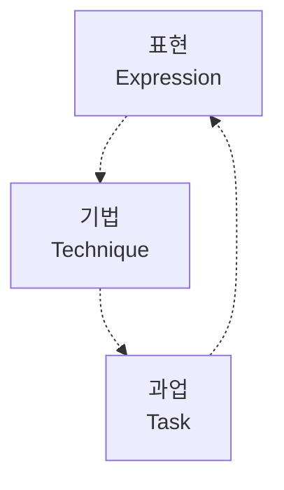

텍스트 분석의 요소 단위(Element unit)가 무엇인가?

어떤 기술과 기법(Technique)을 적용하여 텍스트를 분석하는가?

무엇을 위하여 텍스트 데이터를 분석하는가?

---


# 1 표현

## 📄 표현(Representation)

○ 텍스트 분석의 요소 단위(Element unit)가 무엇인가?

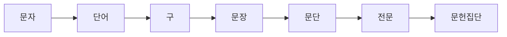

<table>
<thead>
<tr>
<th>문장</th>
<th>단어</th>
<th>형태소</th>
</tr>
</thead>
<tbody>
<tr>
<td>한국어</td>
<td>내 바지는 크다</td>
<td>내 / 바지 / 는 / 크다</td>
<td>내 / 바지 / 는 / 크 / 다</td>
</tr>
<tr>
<td>영어</td>
<td>my pants are big</td>
<td>my / pants / are / big</td>
<td>my / pants / are / big</td>
</tr>
</tbody>
</table>


---


# 2 기법

## 📄 기법(Technique)

● 어떤 기술과 기법(Technique)을 적용하여 텍스트를 분석하는가?

<table>
<tr>
<td>기술적<br>방법</td>
<td>진단적<br>방법</td>
</tr>
<tr>
<td>예측적<br>방법</td>
<td>지시적<br>방법</td>
</tr>
</table>


---


# 2 기법

## 📋 기술적(Descriptive) 방법

● 데이터를 관찰하여 전반적인 정보를 기술(Describe)하는 방법

● 탐색적 데이터 분석(EDA, exploratory data analysis)을 사용

  ○ 텍스트 데이터를 유연하게 탐색하고 데이터의 특징과 구조를 파악

> **예** 소셜미디어의 포스트, 멘션, 페이지 뷰 횟수 등을 분석

---


# 2 기법

## 📊 기술적(Descriptive) 방법

### Sentiment Polarity Boxplot of Department Name

<table>
<thead>
<tr>
<th>Department</th>
<th>Min</th>
<th>Q1</th>
<th>Median</th>
<th>Q3</th>
<th>Max</th>
<th>Color</th>
</tr>
</thead>
<tbody>
<tr>
<td>Tops</td>
<td>-1.0</td>
<td>0.2</td>
<td>0.3</td>
<td>0.4</td>
<td>1.0</td>
<td>Pink</td>
</tr>
<tr>
<td>Dresses</td>
<td>-0.9</td>
<td>0.2</td>
<td>0.3</td>
<td>0.4</td>
<td>1.0</td>
<td>Teal</td>
</tr>
<tr>
<td>Bottoms</td>
<td>-0.6</td>
<td>0.2</td>
<td>0.3</td>
<td>0.4</td>
<td>1.0</td>
<td>Light Blue</td>
</tr>
<tr>
<td>Intimate</td>
<td>-0.6</td>
<td>0.2</td>
<td>0.3</td>
<td>0.4</td>
<td>1.0</td>
<td>Green</td>
</tr>
<tr>
<td>Jackets</td>
<td>-0.8</td>
<td>0.2</td>
<td>0.3</td>
<td>0.4</td>
<td>1.0</td>
<td>Purple</td>
</tr>
<tr>
<td>Trend</td>
<td>-0.3</td>
<td>0.2</td>
<td>0.3</td>
<td>0.4</td>
<td>0.6</td>
<td>Brown</td>
</tr>
</tbody>
</table>

### Review Text Word Count Distribution

<table>
<thead>
<tr>
<th>Word Count Range</th>
<th>Frequency</th>
</tr>
</thead>
<tbody>
<tr>
<td>10-15</td>
<td>250</td>
</tr>
<tr>
<td>15-20</td>
<td>350</td>
</tr>
<tr>
<td>20-25</td>
<td>400</td>
</tr>
<tr>
<td>25-30</td>
<td>450</td>
</tr>
<tr>
<td>30-35</td>
<td>500</td>
</tr>
<tr>
<td>35-40</td>
<td>520</td>
</tr>
<tr>
<td>40-45</td>
<td>540</td>
</tr>
<tr>
<td>45-50</td>
<td>520</td>
</tr>
<tr>
<td>50-55</td>
<td>500</td>
</tr>
<tr>
<td>55-60</td>
<td>480</td>
</tr>
<tr>
<td>60-65</td>
<td>450</td>
</tr>
<tr>
<td>65-70</td>
<td>400</td>
</tr>
<tr>
<td>70-75</td>
<td>350</td>
</tr>
<tr>
<td>75-80</td>
<td>300</td>
</tr>
<tr>
<td>80-85</td>
<td>600</td>
</tr>
<tr>
<td>85-90</td>
<td>700</td>
</tr>
<tr>
<td>90-95</td>
<td>750</td>
</tr>
<tr>
<td>95-100</td>
<td>800</td>
</tr>
<tr>
<td>100-105</td>
<td>750</td>
</tr>
<tr>
<td>105-110</td>
<td>600</td>
</tr>
<tr>
<td>110-115</td>
<td>400</td>
</tr>
</tbody>
</table>

📄 출처 | www.kdnuggets.com/2019/05/complete-exploratory-data-analysis-visualization-text-data.html


---


# 2 기법

## 📄 예측적(Predictive) 방법

* 데이터로부터 변수 사이의 근본적인 관계성을 찾는 방법, 미래에 일어날 일을 예측

* 지도학습(Supervised learning)을 사용

  - 입력과 레이블(Label) 데이터 사이의 패턴을 학습하는 방법

> **예** 학습된 감성 분석 모델을 이용하여 새로운 텍스트의 감성을 예측

---


# 2 기법

## 📋 예측적(Predictive) 방법

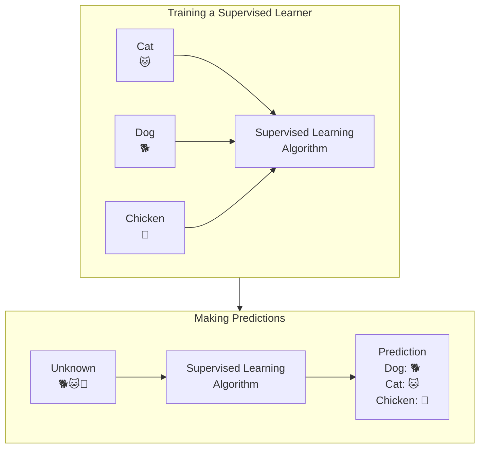

📄 출처 | towardsdatascience.com/supervised-vs-unsupervised-learning-in-2-minutes-72dad148f242

---


# 2 기법

## 📋 진단적(Diagnostic) 방법

* 데이터를 군집화(Clustering) 등 가공하여 데이터에서 특이한 정보를 찾는 방법

* 비지도학습(Unsupervised learning)을 사용

  * 레이블(Label)이 없는 데이터로부터 패턴을 학습

> **예** 텍스트를 주제별로 군집화(Clustering)

---


# 2 기법

## 📋 진단적(Diagnostic) 방법

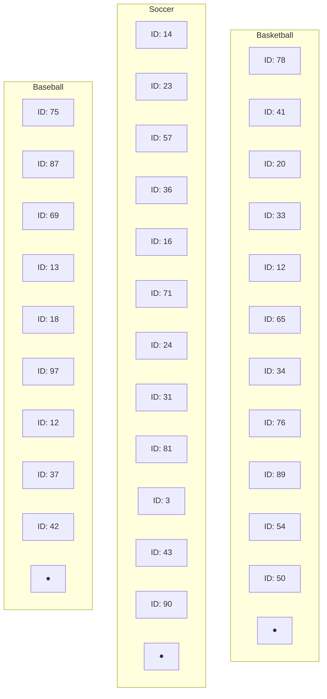

<table>
<tr>
<td><strong>Basketball</strong></td>
<td><strong>Soccer</strong></td>
<td><strong>Baseball</strong></td>
</tr>
<tr>
<td>
ID: 78, ID: 41, ID: 20, ID: 33, ID: 12, ID: 65, ID: 34, ID: 76, ID: 89, ID: 54, ID: 50
<br>● (Green cluster center)
</td>
<td>
ID: 14, ID: 23, ID: 57, ID: 36, ID: 16, ID: 71, ID: 24, ID: 31, ID: 81, ID: 3, ID: 43, ID: 90
<br>● (Blue cluster center)
</td>
<td>
ID: 75, ID: 87, ID: 69, ID: 13, ID: 18, ID: 97, ID: 12, ID: 37, ID: 42
<br>● (Black cluster center)
</td>
</tr>
</table>

📄 출처 | towardsdatascience.com/unsupervised-text-classification-with-lbl2vec-6c5e040354de

---


# 2 기법

## 📄 지시적(Prescriptive) 방법

* 한가지, 혹은 그 이상의 최적의 행동(Action)을 추천하며 각 결정의 예상 결과를 보여줌

* 강화학습(Reinforcement learning)을 사용

  ▶ 주어진 상황에서 최적의 행동을 하기 위해 반복적인 시행착오를 통해 보상을 많이 받는 방향으로 학습하는 방식

> **예** 텍스트 데이터를 활용한 비즈니스 결정

---


# 3 과업

## 📋 과업(Task)

● 무엇을 위하여 텍스트 데이터를 분석하는가?

● 문서 분류/생성/요약, 감성분석, 토픽 모델링, 기계번역, 네트워크 분석, 개체명 인식 등

<table>
<thead>
<tr>
<th>NLP Task Category</th>
<th>Description</th>
<th>Position</th>
</tr>
</thead>
<tbody>
<tr>
<td>Document Classification</td>
<td>문서 분류</td>
<td>Top Left</td>
</tr>
<tr>
<td>Dialog Systems</td>
<td>대화 시스템</td>
<td>Top Center</td>
</tr>
<tr>
<td>Word Sense Disambiguation</td>
<td>단어 의미 중의성 해소</td>
<td>Top Right</td>
</tr>
<tr>
<td>Machine Translation</td>
<td>기계 번역</td>
<td>Middle Left</td>
</tr>
<tr>
<td>Natural Language Processing</td>
<td>자연어 처리 (중심)</td>
<td>Center</td>
</tr>
<tr>
<td>Summarization and Generation</td>
<td>요약 및 생성</td>
<td>Middle Right</td>
</tr>
<tr>
<td>Question and Answer</td>
<td>질의응답</td>
<td>Bottom Left</td>
</tr>
<tr>
<td>Sentiment Analysis</td>
<td>감성 분석</td>
<td>Bottom Center</td>
</tr>
<tr>
<td>CoReference Resolution</td>
<td>상호참조 해결</td>
<td>Bottom Right</td>
</tr>
</tbody>
</table>

📄 출처 | gipplab.org/deep-learning-for-natural-language-processing

---


# 3 과업

## 📄 문서 분류(Text classification)

* 텍스트를 입력으로 받아 텍스트가 어떤 범주(Class)에 속하는지 분류

예| 문서의 주제 분류, 스팸/정상 이메일 분류 등

* 로지스틱회귀, 트리, SVM, 딥러닝 등 지도학습 알고리즘 사용

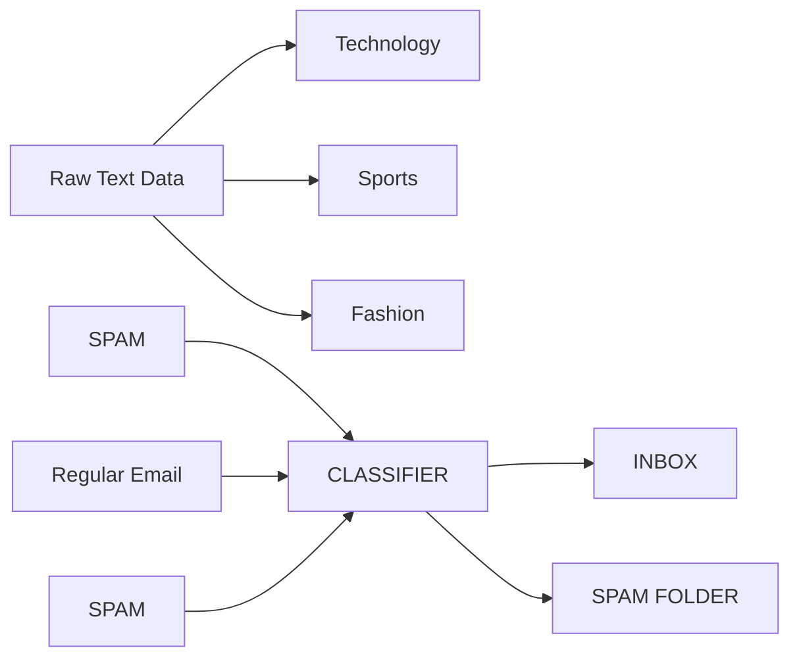

📄 출처 | Towards Data Science, Google Developers


---


# 3 과업

## 📄 문서 생성(Text generation)

* 사람이 쓴 것과 유사한 새로운 문장을 만들어내는 과업

  * 입력 텍스트를 기반으로 하여 새로운 문장을 생성

<table>
<tr>
<td>
<strong>Inputs</strong><br><br>
<strong>Input</strong><br>
Once upon a time,
</td>
<td>
<strong>Text<br>
Generation<br>
Model</strong>
</td>
<td>
<strong>Output</strong><br><br>
<strong>Output</strong><br>
Once upon a time, we knew that our ancestors were on the verge of extinction. The great explorers and poets of the Old World, from Alexander the Great to Chaucer, are dead and gone. A good many of our ancient explorers and poets have
</td>
</tr>
</table>

📄 출처 | huggingface.co/tasks/text-generation

---


# 3 과업

## 📄 문서 요약(Text summarization)

* 주어진 문서에서 중요하고 흥미로운 내용을 추출하여 요약문을 생성하는 과업

  ▷ 연속된 단어를 입력 받아 더 짧은 연속된 단어를 출력

### Text Summarization using NLP

<table>
<tr>
<td>
<strong>Natural Language Processing</strong><br><br>
Natural language processing (NLP) is a subfield of linguistics, computer science, and artificial intelligence concerned with the interactions between computers and human language, in particular how to program computers to process and analyze large amounts of natural language data. The result is a computer capable of "understanding" the contents of documents, including the contextual nuances of the language within them. The technology can then accurately extract information and insights contained in the documents as well as categorize and organize the documents themselves.
</td>
<td>
<strong>Summary</strong><br>
summarize(text, 0.6)
</td>
<td>
<strong>Natural Language Processing</strong><br><br>
Natural language processing (NLP) is a subfield of linguistics, computer science, and artificial intelligence concerned with the interactions between computers and human language, in particular how to program computers to process and analyze large amounts of natural language data.
</td>
</tr>
</table>

출처 | turbolab.in/types-of-text-summarization-extractive-and-abstractive-summarization-basics


---


# 3 과업

## 📄 감성 분석(Sentiment analysis)

* 텍스트에 나타난 사람들의 의견과 성향 등 주관적인 데이터를 분석

예| 영화 긍·부정 리뷰, 정치적 보수·진보 성향 등

* 오피니언 마이닝(Opinion mining)이라고도 불림

<table>
<tr>
<td>
😊<br>
<strong>POSITIVE</strong><br>
"Great service for an affordable price. We will definitely be booking again."
</td>
<td>
😐<br>
<strong>NEUTRAL</strong><br>
"Just booked two nights at this hotel."
</td>
<td>
☹️<br>
<strong>NEGATIVE</strong><br>
"Horrible service. The room was dirty and unpleasant. Not worth the money."
</td>
</tr>
</table>

출처 | wikidocs.net/202248


---


# 3 과업

## 📄 토픽 모델링(Topic modeling)

* 문서의 추상적인 '주제'를 발견하기 위한 통계적 모델

  > 문서를 하나의 주제로 판단, 주제를 구성하고 있는 토픽을 찾아내고 문장을 분류

* 특정 주제에 관한 문서에서는 그 주제에 관한 단어가 다른 단어들에 비해 더 자주 등장한다고 가정

  > LDA(Latent Dirichlet Allocation, 잠재 디리클레 할당)가 대표적인 알고리즘

---


# 3 과업

## 📄 토픽 모델링(Topic modeling)

<table>
<tr>
<td style="vertical-align: top; width: 20%;">

**Topics**

**Topic 1 (Yellow):**
- gene: 0.04
- dna: 0.02
- genetic: 0.01
- ...

**Topic 2 (Pink):**
- life: 0.02
- evolve: 0.01
- organism: 0.01
- ...

**Topic 3 (Green):**
- brain: 0.04
- neuron: 0.02
- nerve: 0.01
- ...

**Topic 4 (Blue):**
- data: 0.02
- number: 0.02
- computer: 0.01
- ...

</td>
<td style="vertical-align: top; width: 50%;">

**Documents**

**Seeking Life's Bare (Genetic) Necessities**

COLD SPRING HARBOR, NEW YORK - Scientists are racing to decipher the DNA sequences of the tiniest free-living organisms on the planet. One research team, led by molecular biologist Craig Venter at The Institute for Genomic Research in Rockville, Maryland, recently announced that it had sequenced the complete genome of Mycoplasma genitalium, a parasitic bacterium that causes urethritis in humans. The organism has the smallest known genome of any free-living creature - just 470 genes compared with about 4,000 in the bacterium Escherichia coli.

*Genome Mapping and Sequencing, Cold Spring Harbor, New York, May 8 to 12*

*Stripping down: Computer analysis can strip away all but the minimum modern and ancient genomes*

</td>
<td style="vertical-align: top; width: 30%;">

**Topic proportions and assignments**

[Diagram showing colored dots connected by lines to a bar chart, representing how different topics are distributed within the document]

</td>
</tr>
</table>

----

출처 | www.analyticsvidhya.com/blog/2016/08/beginners-guide-to-topic-modeling-in-python

---


# 3 과업

## 📄 기계번역(Machine translation)

* 사람이 사용하는 자연언어를 컴퓨터를 이용하여 다른 언어로 번역하는 과업

  - 문장의 맥락을 파악 후 어순, 의미 등을 반영하여 다른 언어의 문장으로 재배치

<table>
<tr>
<td></td>
<td>知</td>
<td>识</td>
<td>就</td>
<td>是</td>
<td>力</td>
<td>量</td>
<td>&lt;end&gt;</td>
</tr>
<tr>
<td></td>
<td>↓</td>
<td>↓</td>
<td>↓</td>
<td>↓</td>
<td>↓</td>
<td>↓</td>
<td>↓</td>
</tr>
<tr>
<td>Encoder</td>
<td>e<sub>0</sub></td>
<td>e<sub>1</sub></td>
<td>e<sub>2</sub></td>
<td>e<sub>3</sub></td>
<td>e<sub>4</sub></td>
<td>e<sub>5</sub></td>
<td>e<sub>6</sub></td>
</tr>
<tr>
<td colspan="7"></td>
</tr>
<tr>
<td>Decoder</td>
<td>d<sub>0</sub></td>
<td>d<sub>1</sub></td>
<td>d<sub>2</sub></td>
<td>d<sub>3</sub></td>
<td></td>
<td></td>
<td></td>
</tr>
<tr>
<td></td>
<td>↓</td>
<td>↓</td>
<td>↓</td>
<td>↓</td>
<td></td>
<td></td>
<td></td>
</tr>
<tr>
<td></td>
<td>Knowledge</td>
<td>is</td>
<td>power</td>
<td>&lt;end&gt;</td>
<td></td>
<td></td>
<td></td>
</tr>
</table>

📄 출처 | medium.com/syncedreview/history-and-frontier-of-the-neural-machine-translation-dc981d25422d

---


# 3 과업

## 📋 네트워크 분석(Network analysis)

* 텍스트의 관계를 노드와 링크로 모형화하여 구조, 확산 및 진화과정을 계량적으로 분석

### Network Analysis Interface

**Filter Controls:**
- Filter: All the Statements (10677 | 100%)
- Search this graph

**Network Visualization:**
The network graph displays interconnected nodes with key terms including:
- Central nodes: find, family, friend, world
- Secondary nodes: secret, save, journey, team, travel, city, comedy, school, year, crime, time, teen, drama, base, dream, true
- Peripheral nodes: special, agent, stand, set, show, return, solve, day, live, home, struggle, murder, father, move, mother, death
- Connection indicators: back, take, son

**Analysis Panel:**

**Tabs:** Essence | Insight | Trends | Stats

**Sentiment:** LDA

**Main Topical Groups:**
- 20%: find → friend → family
- 16%: year → father → son
- 16%: world → back → save
- 13%: crime → drama → true

**Navigation:** [<] [1] full stats [>]

**Most Influential Elements:**
- find → family → friend → world

**Navigation:** [<] [1] Reveal Non-obvious [>]

**Network Structure:** Focused | 0.4

**Controls:** Reset Graph | Export: Show Options

**Annotations:**
- "add most typical topic the stopwords list" (top right)
- "latent topics revealed" (bottom center)

----

📄 출처 | noduslabs.com/category/cases/text-network-analysis

---


# 3 과업

## 📄 개체명 인식(Named-entity recognition)

○ 텍스트 내의 개체명을 미리 정의된 분류로 위치시키고 분류하는 기술

○ 어떤 이름을 의미하는 단어가 어떤 유형에 해당하는지를 인식

> **예** Obama : person, the United States : location 등

**Named Entity Recognition 예시:**

Entity Types: Person (p), Loc (l), Org (o), Event (e), Date (d), Other (z)

**Barack Hussein Obama II** *(Person)* (born **August 4, 1961** *(Date)*) is an **American** *(Other)* attorney and politician who served as the 44th President of **the United States** *(Location)* from **January 20, 2009** *(Date)* to **January 20, 2017** *(Date)*. A member of the **Democratic Party** *(Organization)*, he was the first **African American** *(Other)* to serve as president. He was previously a **United States Senator** *(Other)* from **Illinois** *(Location)* and a member of the **Illinois State Senate** *(Organization)*.

📄 출처 | www.analyticsvidhya.com/blog/2021/11/a-beginners-introduction-to-ner-named-entity-recognition/

---


# 학습정리
LEARNING SUMMARY

# 텍스트 마이닝(Text mining)

* 대량의 텍스트 데이터셋에서 ████████들을 찾아내는 것 (Usama Fayad)

* 문자로 된 다른 자료들로부터 자동적으로 정보를 추출하는 이전에 알려지지 않은 새로운 정보의 발견(Marti Hearst)

---


# 학습정리
LEARNING SUMMARY

## 텍스트 마이닝 과정

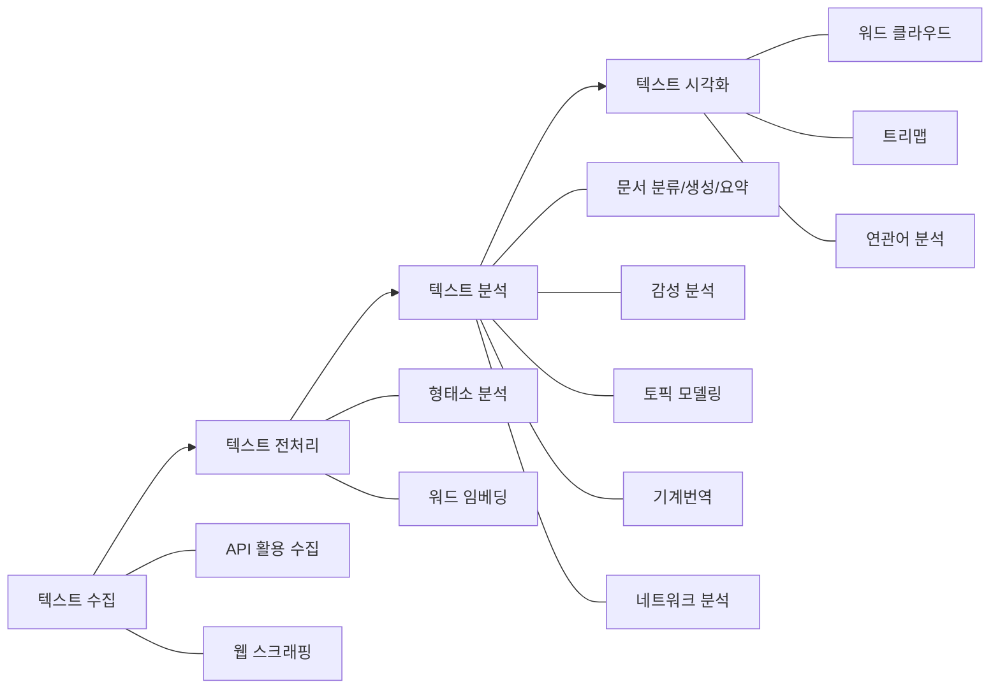

### 텍스트 수집
* API 활용 수집
* 웹 스크래핑

### 텍스트 전처리
* 형태소 분석
* 워드 임베딩

### 텍스트 분석
* 문서 분류/생성/요약
* 감성 분석
* 토픽 모델링
* 기계번역
* 네트워크 분석

### 텍스트 시각화
* 워드 클라우드
* 트리맵
* 연관어 분석

---


학습정리
LEARNING SUMMARY

# 텍스트 분석의 접근 방법

• 텍스트 분석의 요소 단위(Element unit)가 무엇인가?

• 어떤 기술과 기법(Technique)을 적용하여 텍스트를 분석하는가?

• 무엇을 위하여 텍스트 데이터를 분석하는가?

---


# 참고문헌
**REFERENCES**

📚 텍스트 마이닝, 송민, 2017

📚 딥 러닝을 이용한 자연어 처리 입문, 유원준 외, 2023

📚 Text Mining and Analytics, ChengXiang Zhai, University of Illinois at Urbana-Champaign

사용서체 | 나눔바른고딕(주. 네이버), 에스코어드림체(주. 에스코어)


---


이 강의록은 저작권법에 의해 보호받는 저작물로서 저작권자의 허락 없이 저작재산권 일체 (복제권, 배포권, 대여권, 공연권, 공중전송권, 전시권, 2차적 저작물 작성권)를 침해 시 저작권법에 의거 처벌받을 수 있습니다.